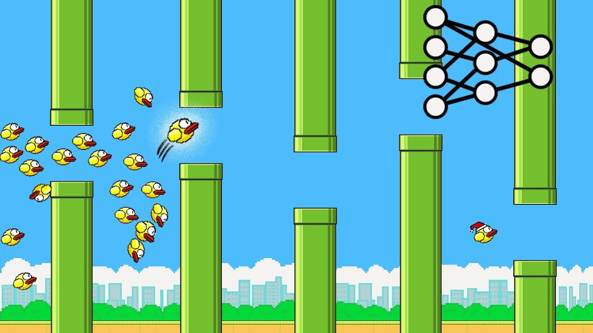

# NEAT Flappy Bird AI

An AI implementation that learns to play Flappy Bird using NEAT (NeuroEvolution of Augmenting Topologies), a genetic algorithm that evolves neural networks.



## About the Project

This project uses the NEAT algorithm to train an AI to play Flappy Bird. The neural network evolves over generations, progressively getting better at navigating through pipes. Key features:

- Neural networks control bird actions
- Population-based training using genetic algorithms
- Fitness-based selection for evolution
- Visual display of training progress

## Requirements

- Python 3.6 or higher
- pygame
- neat-python

## Installation

### Step 1: Clone the repository

```bash
git clone https://github.com/kitan23/NEAT_flappy_bird.git
cd NEAT_flappy_bird
```

### Step 2: Set up a virtual environment (recommended)

```bash
# Create a virtual environment
python -m venv venv

# Activate the virtual environment
# On Windows:
venv\Scripts\activate
# On macOS/Linux:
source venv/bin/activate
```

### Step 3: Install dependencies

```bash
# Install required packages
pip install -r requirements.txt
```

## Usage

To run the AI training:

```bash
python flappy_bird.py
```

During execution:
- Watch as birds learn to navigate through pipes
- The terminal will display information about each generation
- Progress indicators show the current generation, score, and fitness

## Configuration

The behavior of the NEAT algorithm can be customized by modifying the `config-feedforward.txt` file:

- `pop_size`: Controls the population size in each generation
- `fitness_threshold`: The fitness level at which training will stop
- `num_inputs`: Number of inputs to the neural network (3 by default - bird's y position, distance to top pipe, distance to bottom pipe)
- `num_outputs`: Number of outputs from the neural network (1 by default - jump or don't jump)

Feel free to experiment with these settings to optimize training for your system.

## How It Works

1. A population of birds (each controlled by its own neural network) is initialized
2. Each bird attempts to navigate through the pipes
3. Birds are assigned fitness scores based on how far they progress
4. The best performers are selected to reproduce, creating the next generation
5. Mutation and crossover introduce variation in the neural networks
6. The process repeats until birds can successfully play the game

## License

[MIT License](https://opensource.org/licenses/MIT)

## Acknowledgments

- Based on the NEAT-Python implementation by CodeBullet
- Flappy Bird game assets used under fair use

